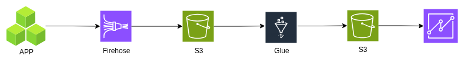

# Key Components of a Good Data Lake On AWS

## 1. Storage
* [S3](../Storage/S3.md) for storing `large volumes` of `unstructured` data.
* With [Lifecycle Policies]() to manage storage costs by `moving` `infrequently` accessed data to cheaper storage classes or [S3 Glacier]().

## 2. Data Movement
* Use [Kinesis](../Analytics/Kinesis.md) for real-time `streaming`, database `migration services` for `bulk data transfers`, or `Snowball` for `physical` data `transfer`.
## 3. Data Cataloging and Discovery
* Create `metadata` to describe `data formats`, `sensitivity`, and other `relevant information`.
* AWS [Glue]() to manage [ETL]() service with a robust data catalog for `automated` data `discovery` and `cataloging`.
## 4. Generic Analytics
* [Kinesis](../Analytics/Kinesis.md) Data `Analytics` for `real-time` insights.
* [Athena](../Analytics/Athena.md) for SQL-based `queries` on `S3` data for `interactive insights`.
* QuickSight for creating visualizations `dashboard`.
Redshift for in-depth analysis on structured data for data warehouse.
## 5. Predictive Analytics
* SageMaker for building, training, and deploying `machine learning models for predictions`.
* Deep Learning AMIs for `advanced analytics` with `deep learning`.

   

## How To Build A Data Lake?

### 1. Manual approach
* `Assemble` all the data lake pieces `by hand`. 
* This `requires` a lot of `time` and `expertise` in AWS services.

### AWS Lake Formation Service
* `Service` `helps` you `set up` a data lake in a secure manner and takes `only a few days`. 
* `crawls` and `catalogs` your data from `various sources` including [S3](../Storage/S3.md), relational databases, NoSQL databases, [CloudTrail](../Monitoring/CloudTrail.md) logs, [Kinesis](../Analytics/Kinesis.md) Firehose logs, [Elastic Load Balancers](../Networking/ElasticLoadBalancer.md) logs, and [CloudFront](../Edge-Services/CloudFront.md) logs.

#### steps involved in using AWS Lake Formation to build a data lake
1. `Identify` the `data sources` you want to `move` to the `data lake`.
2. Specify the `target location` in the `data lake` where you want to `load the data`.
3. Define the `frequency` of `loading` the data.
4. `Lake Formation` will then `discover` the `schema` of the `source data`
    * convert it to a `new target format`, `partition` the data, and keep `track` of the da`ta that has already been `processed`.
5. It will also `set up self-service` access to the data `through` your `choice` of `analytic` services by tying `data access` with `access control policies` within the data catalog.

#### Pricing
* Lake Formation Service is `free` but with `hidden costs` of the other services usage