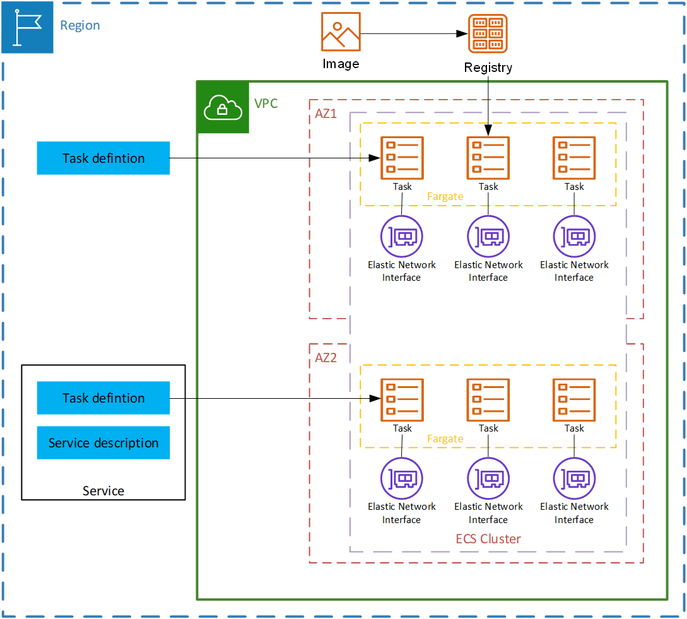

# Container

## Elastic Container Service (ECS)
* Fully managed container `orchestration platform`.
* Developing, managing, and scaling containerized workloads.
* Uses Docker containers.

### Core Components
| Component | Description |
|-----------|-------------|
| **Container** | Fundamental unit for running apps in ECS. |
| **Capacity** | Where containers run: EC2, Fargate, On-prem VMs/servers. |
| **AMI** | Base image with Linux distro, ECS Agent, Docker runtime. |
| **Task** | Logical group of up to **10 containers** running together on the same instance. |
| **Task Definition** | Blueprint for how containers run (image, CPU/mem, ports, env vars, storage, logging). |
| **Service** | Runs and maintains a specified number of Task Definition instances. Ensures tasks are always running (auto-replacement & scaling). |
| **Cluster** | Logical grouping of compute resources (EC2, Fargate, Outposts). Provides runtime environment for tasks/services. |
| **Scheduler** | Assigns tasks to instances based on constraints (capacity, placement). |
| **Controller** | Orchestration layer ensuring tasks/services run as defined. |
| **Provisioning & Management Tools** | ECS Console, CLI, SDKs, CloudFormation, CDK, Terraform, Auto Scaling. |

  

#### Networking
- **EC2 Launch Type** → Tasks share the **subnet** of the EC2 host.  
- **Fargate Launch Type** → You **choose** the VPC & subnet per task/service.  
- **Placement Options**:  
  - Availability Zones (AZs)  
  - Local Zones  
  - Wavelength Zones  
  - AWS Regions  
  - Outposts (on-prem)  

  

### Task Definition Config
Defines *how* ECS runs your containers:
- **Container images** (ECR or Docker Hub).  
- **# of containers** per task.  
- **CPU & memory** requirements.  
- **Networking mode** → `bridge`, `awsvpc`, or `host`.  
- **Port mappings** → e.g., expose `80 → 8080`.  
- **Environment variables & secrets**.  
- **Storage volumes** → shared between containers in a task.  
- **Logging config** → send logs to CloudWatch.  

  

### Application Lifecycle
1. **Containerize the Application**  
   Package code, libraries, configs into a container.  

2. **Build & Store Images**  
   Push images into **Amazon ECR** or Docker Hub.  

3. **Define a Task (Task Definition)**  
   - Container specs: image, ports, CPU/memory.  
   - Env vars, storage, logging, secrets.  

4. **Deploy to a Cluster**  
   - ECS uses Task Definition to run tasks inside a cluster.  

5. **Run Workloads**
   - **Standalone Task** → one-off jobs, batch jobs.  
   - **Service** → long-running apps, auto-scaling, fault tolerance.  

6. **ECS Agent & Orchestration**
   - **EC2**: ECS Agent reports resources, starts/stops tasks.  
   - **Fargate**: AWS manages agent for you.  
   - Orchestrator ensures desired number of tasks are running.  

  

  

### Fargate
* `Serverless`, `pay-as-you-go` `compute engine` that lets you focus on building applications `without` `managing` `servers`.
* Has `native integration` with AWS services `including`:
    * [VPC](../Vpc)
    * [Auto Scaling](../Databases#auto-scaling)
    * [Elastic Load Balancing](../Networking/ElasticLoadBalancer.md)
    * [IAM](../Security/Identity-Access-Management(IAM).md)
    * **Secrets Manager**
* Suitable for:
    * `Large workloads`
    * `Small workloads`
    * `Tiny workloads`
    * `Batch workloads`

 

  

### Steps To Deploy A Container

1. **Create an ECS Cluster**
    * Consists of `compute nodes` on AWS Fargate or Amazon EC2.
2. **Define a Task Definition**
    * Specifies `container image(s)`, CPU, memory, networking, and launch type.
    * Defines how `containers` are `linked` and `interact`.
3. **Run Tasks or Services**
    * **Tasks**: `Deploy` a `set` of `containers once`.
    * **Services**: `Maintain` a `desired number` of running `tasks` for high `availability`.
4. **Load Balancing with ALB**
    * ALB `routes` traffic to `container` `instances` based on `URL paths`.
    * Ensures scalable, `distributed access` to service containers.

  

## Pricing
* Only pay for the underlying compute and resources you use.

  

## Elastic Kubernetes Service (EKS)

* Managed [Kubernetes](../Distributed-System.md#kubernetes) service.
* `Instead` of you `manually` setting up and managing Kubernetes clusters (which is complex), `AWS handles` the `control plane` (API server, etcd, scheduler, etc.).
* You just `manage` the `worker` nodes (where your containers/pods actually run) — or even let `AWS handle` that with `Fargate`.

### Features
* **Managed Control Plane**
    * AWS runs, scales, patches, and secures the Kubernetes control plane for you.
* **Worker Nodes**
    * Can run on EC2 (your choice of instance type) or AWS Fargate (serverless, no VM management).
* **Networking**
    * Deep `integration` with AWS VPC, IAM, ELB, CloudWatch, etc.
* **Scalability**
    * `Auto-scaling` clusters and pods.
* **Security**
    * `Tied` into `AWS IAM` for authentication and authorization.

### EKS Vs ECS
To Clarify Both can host workloads and scale, but they’re different ecosystems. 

| Topic            | Amazon ECS                                        | Amazon EKS                                                            |
|------------------|---------------------------------------------------|------------------------------------------------------------------------|
| **Complexity**   | Simplifies cluster creation and maintenance        | Provides more control over cluster using a complex interface            |
| **Scaling**      | Automated scaling based on demand                  | Manual configuration of autoscaling groups                             |
| **Toolset**      | Amazon ECS toolset                                 | Kubernetes toolset                                                     |
| **Team Experience** | New to container cluster architecture | Familiar with Kubernetes cluster architecture and control processes |

### Steps to Deploy a Container

1. `Create` an Amazon `EKS Cluster`
    * `Cluster` consists of `worker nodes` on AWS `Fargate` or Amazon `EC2`.
2. Deploy `Pods`
    * Kubernetes `Pods` are the `smallest` `deployment` `units`, running `one` or `more` `containers`.
    * `PodSpec` `defines` the container `image`, `resources`, and `networking`.
3. Use `Deployments` for Scaling
    * A `Deployment` creates a `ReplicaSet` to `maintain` the desired `number` of `Pods`.
4. Enable `Communication` with `Services`
    * A Kubernetes Service `routes network` traffic to available `Pods` using `labels`.

  

### Pricing
* **Control Plane Fee**: AWS charges $0.10 per cluster per hour for the EKS control plane (about $72/month) 
* **Extended Support Zone**: For Kubernetes versions past standard support, the fee increases to $0.60 per hour