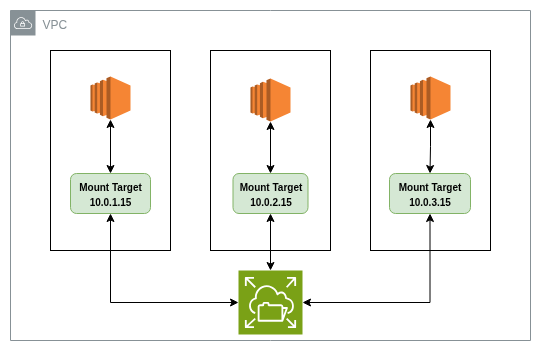

# EC2 instances

| Instance Name | vCPU | Memory (GB) | Storage   |
|---------------|------|-------------|-----------|
| t3.nano       | 2    | 0.5         | EBS-Only |
| t3.micro      | 2    | 1           | EBS-Only |
| t3.small      | 2    | 2           | EBS-Only |
| t3.medium     | 2    | 4           | EBS-Only |
| t3.large      | 2    | 8           | EBS-Only |
| t3.xlarge     | 4    | 16          | EBS-Only |
| t3.2xlarge    | 8    | 32          | EBS-Only |

  

## EC2 instance type naming and sizes and components
* Family
* Generation
* Processor family
* Additional capabilities
* Size

Example: **c6gn.medium**
* C: is the family
* 6: is the generation
* g: is the processor family
* n: additional capabilities
* medium: is the size

  

## AWS Instance Families and Workloads

| Type                               | Workload                                                                                       | Instance Types                                                                 |
|------------------------------------|------------------------------------------------------------------------------------------------|--------------------------------------------------------------------------------|
| General Purpose                    | Web or application servers, Enterprise applications, Gaming servers, Development or test environments | M7, Mac, M6, M5, M4, T4, T3, T                                                 |
| Compute Optimized                  | Batch processing, Distributed analytics, High performance computing (HPC)                      | C7, C6, C5, C4                                                                 |
| Storage Optimized                  | High-performance databases, Real-time analytics, Transactional workloads                        | I4, Im4, Is4, I3, D2, D3, H1                                                   |
| Memory Optimized                   | In-memory caches, High-performance databases, Big data analytics                               | R7, R6, R5, R4, X2, X1, Z1                                                     |
| Accelerated Computing              | Machine learning, Artificial intelligence (AI), HPC                                            | P5, P4, P3, P2, DL1, Trn1, Inf2, Inf1, G5, G4, G3, F1, VT1                      |
| High Performance Computing (HPC)   | Deep learning workloads, Compute-intensive HPC workloads                                       | Hpc7, Hpc6                                                                     |

As a recommendation, choose new generation instance types in a family because they generally have better price-to-performance ratios.

  

## Compute Optimizer
* Service analyzes the configuration and utilization metrics of EC2 instances and Auto Scaling groups
* Generates optimization recommendations to reduce the cost and improve the performance of your workloads
* Use these recommendations to decide whether to move to a new instance type.

The **Compute optimizer** returns one of this result:
the aws compute optimizer returns one of this results

* **Under-provisioned** – Needs more resources.
* **Over-provisioned** – Uses more than required.
* **Optimized** – Well-configured.
* **None** – Not enough data or unsupported instance type.

  

## EC2 Storage Overview
# AWS EC2 Storage Resources

| AWS EC2 Storage Resource                   | Root Volume Ready? | Data Volume for a Single Instance | Accessible from Multiple Linux Instances | Accessible from Multiple Windows Instances |
|--------------------------------------------|--------------------|----------------------------------|------------------------------------------|--------------------------------------------|
| Elastic Block Store EBS               | Yes                | Yes                              | No                                       | No                                         |
| Instance Store                             | Yes                | Yes                              | No                                       | No                                         |
| Elastic File System (EFS)    | No                 | No                               | Yes                                      | No                                         |
| FSx for Windows File Server         | No                 | No                               | No                                       | Yes                                        |

### Elastic Block Storage (EBS)
* `Network-attached` block storage for EC2, `not tied` to the same compute machine.
* Think of it like a `virtual hard disk` that you can attach to your instances.
* `Persistent` Data remains even if the instance is stopped or terminated.
* Can `only be attached` to `one EC2 instance at a time (in the same AZ)`.
* Can be `encrypted`.
* Supports `snapshots` that are persisted to [S3]().
* We can use `EBS-optimized instances` so that I/O access to an EBS volume is increased.

#### EBS (hdd vs ssd)
**Amazon EBS SSD-backed volume types**
Optimized for transactional workloads that involve frequent read/write operations with small I/O size, `I/O ops peer sec`
* SSD Types: 
* * `General Purpose SSD (gp2)`
* * `Provisioned IOPS SSD (io1)` it like the ultimate version of (gp2)
**Amazon EBS HDD-backed volume types**
optimized for large, sequential, streaming workloads.
* Hdd Types:
* * `Throughput Optimized HDD (st1)`
* * `Cold HDD (sc1)` work with for `less-frequently` accessed workloads with large, cold datasets.

### instance store
* Volume provides temporary block-level storage for your instance. 
* `Physically-attached` to the computer that hosts the running instance, `tied` to the same compute machine.

### Elastic File System (EFS)
* Provides `Shared access` file system storage for Linux-based workloads `(Cross AZ)`.
* `Scales automatically`.
* Supports Network File System `(NFS)` protocols.
* Compatible with all `Linux-based` AMIs for EC2.
* `Very large capacity`.
* `EC2` connects to `EFS` throw `mount target` which is entry point with (Private IP, `Security Group`) on specific AZ

### FSx for Windows File Server
* Fully managed file system built on `Windows Server` folowing `New Technology File System (NTFS)`.
* Supports the `SMB (Server Message Block)` protocol.
* `Windows-based applications` and workloads that need native Windows `file system features`.
* Native Windows integration
* Highly Available.
* Scalable storage & throughput → you can adjust as needed.
* Backups → automatic daily backups to S3.
* Used for : Home directories, Lift-and-shift application workloads, Media and entertainment workflows, Data analytics ,Web serving and content management, Software development environments

  

## User-data
* Is a script you pass to an EC2 instance at launch time.
* Runs automatically when the instance boots for the first time.
* You can modified following the steps:
* 1. Stop the instance.
* 2. Edit the user-data file
* 3. Remove the config_scripts_user file. (To add the modified version later)
* 4. Re-run the script

  

## Amazon Machine Image (AMI)
* Template for launching EC2 instances.
* Includes OS
* Pre-installed software
* (Optional) customizations you baked in.

### How it differs from User Data
* If you want all instances to have a `fixed baseline` (e.g., Apache pre-installed) → add it into your **AMI**.
* If you want each instance to `run setup on launch` (e.g., pull code from GitHub) → use **User Data**.

**Note** can configure EC2 instances at boot time using user data scripts. This method works well alongside custom AMIs

### Enforcing compliance:
1. Regularly scan running instances.
2. Terminate any instance not using the approved AMI.

### Factors to Consider:
* The `more software & configs` you pre-install in your AMI, the `longer it takes to build the AMI`.
* The `more dependencies` & software baked into an AMI, the `faster it becomes outdated`.
* **Tradeoffs**
* * `Minimal AMI` → Slower boot, but easier to maintain.
* * `Pre-baked AMI` → Faster boot, but longer build times & more frequent updates required.

  

## Placement Group 
* is a `way to control` how `EC2 instances` are `physically placed` on `AWS infrastructure` to optimize for performance, fault tolerance, or both.
* Increase network performance between instances.
* Reduce correlated or simultaneous failure (don’t want `multiple EC2 instances` `failing` together just because they are `sitting on the same underlying hardware`).
* An instance can be `launched` in only one `placement group at a time`.
* Instances with a `tenancy` (Who own the underline host hardware) of host can’t be `launched in a placement group`.

### Types of Placement Groups
* **Cluster**: `Packs instances` `close together` inside an `Availability Zone`. This strategy helps workloads to achieve `low-latency` network performance.
* **Partition**: `Spreads` your `instances` across `logical partitions` so that groups of instances in `one partition` `do not share` the `underlying hardware` with groups of instances in `different partitions`.
* **Spread**: `Strictly places` a small group of `instances` across `distinct` underlying hardware to `reduce correlated failures`.

  

## Dedicated Options

### Dedicated Instance
* Runs on hardware isolated to you (no other AWS customers share it).
* Per-instance billing
* Automatic instance placement

### Dedicated Host
* Entire physical server allocated to you.
* Visibility and control over the host → Use your `server-bound software licenses` and address compliance requirements
* Per-host billing
* Add capacity by using an `allocation` request (Essentially setting up your own server)

  

## Auto Scaling Group
* `Logical grouping` of EC2 instances for `automatic` `scaling` & `management`.
* Supports `health check` replacements and `scaling policies`.
* `Scaling Policies`: Define when and `how scaling happens`.
* Integration with Elastic Load Balancing (optional).

### Dynamic scaling
Supports the following types of dynamic scaling policies:
* **Target tracking scaling** Increase and decrease the current capacity of the group based on a `CloudWatch metric` and a `target value`
* **Step scaling** Increase and decrease the current capacity of the group based on a `set of scaling adjustments` `known as step adjustments`
* **Step scaling** Increase and decrease the current capacity of the group based on a `single scaling adjustment`, with a `cooldown` period `between` each scaling `activity`.

### Termination Policies
## Termination Policies

| Termination Policy         | Description                                           |
|----------------------------|-------------------------------------------------------|
| OldestInstance         | Selects the longest-running instance                 |
| NewestInstance         | Selects the shortest-running instance                |
| OldestLaunchTemplate   | Terminates the instance with the oldest launch template (default) |
| ClosestToNextInstanceHour | Terminates the instance closest to the next billable hour (default) |

### Launch Template
* Defines the `blueprint` for EC2 `instances` that `Auto Scaling` will `launch`.

### Pricing
There are `no additional fees` with Amazon EC2 Auto Scaling, so it's easy to try it out and see how it can benefit your AWS architecture. You only `pay for the AWS resources` that you use.

  

## Launch Type
* Suitable for large workloads that must be price optimized.

  

## Pricing
- **On-Demand** Flexible, no commitment, pay per second/hour. Best for short-term or unpredictable workloads.  

- **Reserved Instances (RIs)** Commit to specific instance type for 1–3 years. Significant discounts.  
  - **Standard RI** – Most savings, least flexibility.  
  - **Convertible RI** – Change instance family/type, less savings.  
  - **Scheduled RI** – Reserve capacity for recurring schedules.  

- **Savings Plans** Flexible alternative to RIs. Commit to a consistent $/hr for 1–3 years. Applies across instance families and services.  

- **Spot Instances** Purchase unused capacity at up to 90% off. AWS can reclaim with 2-minute notice. Best for flexible, fault-tolerant workloads.  

- **Dedicated Hosts** Physical servers allocated exclusively to you. Useful for compliance and software licenses bound to hardware.  

- **Dedicated Instances** Run on isolated hardware but AWS manages placement. Still physically separated from other customers.  

- **Capacity Reservations** Reserve capacity in a specific Availability Zone. Can combine with RIs or Savings Plans for discounts.  
