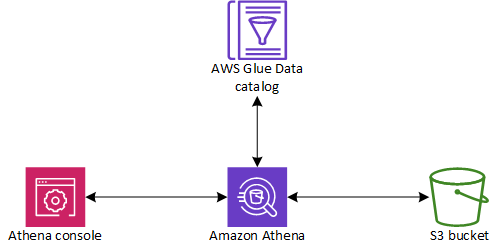

# Athena SQL
* [What Is It](#what-is-it)
* [How It Works](#how-it-works)
* [Use Cases](#use-cases)
* [Athena For Apache Spark](#athena-for-apache-spark)

# What Is It

* Serverless interactive query service by AWS.
* Enables SQL queries on both structured and unstructured data stored in Amazon S3, supporting formats like CSV, JSON, ORC, Parquet, and Avro.
* Integrates with AWS Glue Data Catalog for centralized metadata management, allowing schema creation and updates across AWS.
* Accesses AWS data sources (e.g., RDS, DynamoDB, Redshift) and on-premises databases (e.g., SAP HANA, Db2), supporting federated queries across multiple data sources.
* works natively with Amazon S3 (that’s where it actually scans the data).
* Async service
* Connects to BI tools like QuickSight using JDBC/ODBC for visualization and analysis.
* Allows parallel data processing using Apache Spark, comparable to AWS Glue and Amazon EMR for Spark-based workloads.

  

## How It Works
1. Store your raw/processed data in S3 (CSV, JSON, Parquet, ORC, etc.).
2. Define a schema/table in Athena (using AWS Glue Data Catalog for metadata).
3. Run SQL queries directly on your S3 data.
4. Results are returned in seconds, and can be integrated with QuickSight or other BI tools.

  

## Use Cases
* Ad-hoc queries on data stored in S3 (logs, clickstreams, IoT data).
* Data Lake analytics without needing ETL.
* Powering dashboards with Amazon QuickSight.
* Cheap alternative to loading everything into a database like Redshift.

  

## Athena For Apache Spark
* Run Apache Spark applications interactively.
* run Spark code (PySpark, Scala, R, etc.) directly in Athena.
* Still serverless — no need to manage EMR clusters.

### Use Cases
* advanced ETL
* ML preprocessing
* Custom analytics