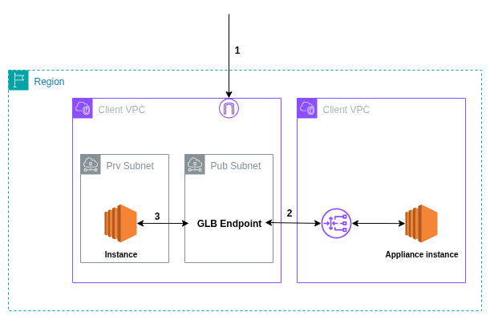

# Elastic Load Balancer

* Aws version of [Load Balancer](../Networking.md#load-balancer)
* Supports multiple protocols (HTTP, HTTPS, TCP, UDP) and advanced routing for modern application architectures
* Works tightly with Auto Scaling Groups to add/remove EC2 instances.
* Integrates with AWS Certificate Manager for SSL/TLS, and supports VPC security groups and AWS WAF to protect against attacks.

  

## Types
* **Application Load Balancer (ALB)** – `Layer 7`, routes based on HTTP/S rules.
    * Native `IPv6` Support
    * `Automatically` knows which `container` is `listening` on which `port`
    * `Deletion Protection` (Prevent Accidental Deletion) and `Request Tracking` (Assigns a unique ID (x-amzn-trace-id) to every request)
    * `Enhanced Metrics` and Access Logs (enhanced `CloudWatch` metrics and detailed access logs)
    * Targeted Health Checks

* **Network Load Balancer (NLB)** – `Layer 4`, handles high-performance TCP/UDP traffic.
    * Allows you to `assign static Elastic IP addresses`, providing a `fixed IP` address across reboots
    * `NLB` [PrivateLink]() Integration serve as the `entry point` to `private applications`
    * `Sticky sessions` send `all requests` from the same client to the `same backend` to maintain `session continuity`.
    * Can `route traffic` to `on-prem` resources if `network connectivity exists` (`Direct Connect`, `VPN`, or `VPC peering`).
    * `CloudWatch` and `VPC Flow Logs` `Integration` Metrics

* **Gateway Load Balancer (GLB)** – Routes traffic through third-party `appliances`.
    * Manage `third-party virtual` `appliances` (firewalls, IDS/IPS, packet inspection systems) into your network traffic flow. (`raw packets or low-level traffic`)
    * More like `Layer 3 LB`
    * `Facilitates` traffic `routing` between `(VPC)` and `appliances` deployed within your network
    * Traffic `Steering` & `Inspection`
    * `Elastic Scaling` & Load `Distribution`
    * Captures and `inspects network` traffic for `security analysis`, `debugging`, and `compliance`.
    * `Simplified Network Management`
    * `Traffic Segmentation`
    * Supports `encrypted` `traffic` `analysis` via third-party appliances.
    * `Integrates` with `CloudWatch` for monitoring and `VPC Flow Logs` for traffic insights.
    

  

## Cross-zone load balancing
**Enabled** Load balancer nodes `distribute` traffic evenly `across` all `targets` in all `enabled Availability Zones`.
**Disabled** Each node `routes` `requests` only within its `own Availability zone`.

**Recomendation**  `Enable cross-zone` load balancing for `more even traffic` distribution and `better resource utilization`.

  

## SSL Server Certificates
* The `ALB` relies on an `X.509` certificate from a `trusted Certificate Authority` (CA). 
* `AWS Certificate Manager` (ACM) `simplifies` `certificate` `provisioning` and management.
* **Certificate Options** You can `assign` an HTTPS `certificate` using:
    * **ACM Certificate** Choose an `AWS-issued certificate`.
    * **Upload to ACM** Import a `third-party certificate`.
    * **IAM Certificate** Use a `certificate` stored in `IAM`.
    * **Upload to IAM Manually** upload a `new IAM certificate`.