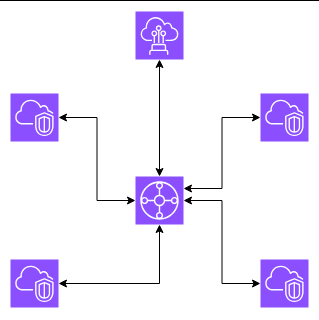
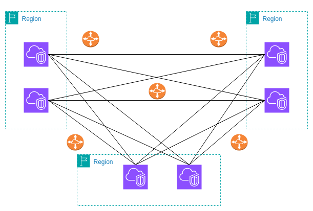
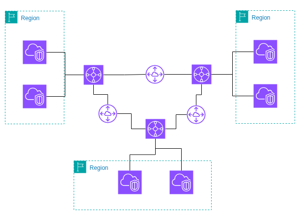

# Transit Gateway

* **Centralized Routing** – Acts as a `hub-and-spoke` model to simplify VPC interconnectivity.
* You can think of it as a high-scale, fully managed **router** for the cloud

## Benefits of Transit Gateway
* **Highly Scalable** – Supports `large-scale environments` with many `VPCs` and hybrid networks.
* **Inter-Region Peering** – Connects transit gateways `across Regions` using the AWS global backbone (not the internet).
* **Hybrid Integration** – Works with [AWS Direct Connect]() and [Site-to-Site VPN]() for seamless `on-premises connectivity`.

 

## Use Cases
Large, complex networks where [VPC peering](./VPC-Peering.md) becomes `unmanageable`.

 

## key concepts
### Supported Connection
* One or more VPCs
* Compatible Software-Defined Wide Area Network (SD-WAN) appliance
* Direct Connect gateway
* Peering connection with another transit gateway
* VPN connection to a transit gateway

### AWS Transit Gateway MTU
Support MTU (Maximum Transmission Unit) of `8500 Bytes` For:
* VPC connections
* Direct Connect connections
* Connections to other transit gateways
* Peering connections
* MTU of 1,500 bytes for VPN connections

### Transit Gateway route table
* Has a default route table
* Can optionally have additional route tables
* table includes dynamic and static routes that decide the next hop based on the destination IP address of the packet.
* The target of these routes can be any transit gateway attachment.
* Each attachment is associated with exactly one route table. Each route table can be associated with zero to many attachments.

### Route propagation
* A VPC, VPN connection, or Direct Connect gateway can dynamically [propagate routes](../Networking.md#route-propagation) to a transit gateway route table.
* On VPC Level you must create static routes to send traffic to the transit gateway.
* With a VPN connection or a Direct Connect gateway
* * On-premises network `advertises` its routes via `BGP` over the Direct Connect link.
* * Direct Connect link receives these routes and `can propagate` them to its attached route tables
* * TGW also `advertises` the routes of its attached VPCs or other networks back to the on-premises network via BGP.
* This ensures two-way dynamic routing: on-prem can reach VPCs, and VPCs can reach on-prem.

## Why Transit Gateway is better for scalability
Let Say we have 3 Region each region Has 2 vpcs 

* if we use [VPC Peering]() Solution we get complicated scheme to manage and maintain of 30 Peering connections

* But With **Transit Gateway** we simplify the design to 3 Perering connection

## Pricing
Transit Gateway only works on a pay-as-you-go model, For More Information Visit [Official AWS Documentation](https://aws.amazon.com/transit-gateway/pricing/)