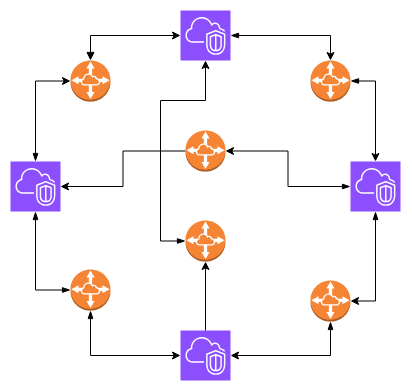
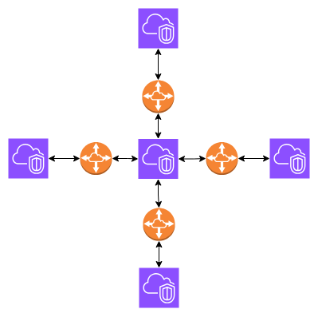

# VPC Peering

A networking connection that lets you route traffic privately between 2 VPCs

### Benefits of VPC peering
* Highly Available

* No Bottlenecks

* Inter-Region Peering (Cross AZ Connections)

* No Public Internet Exposure

* Encrypted Traffic

* Cross-Account Peering

* Cost-Effective

### Peering scenarios
#### 1. Full sharing of resources between all VPCs (Fully Meshed VPC Peering)

  

* Each VPC needs a dedicated peering connection to every other VPC.
* Traffic cannot pass through an intermediary VPC.
* More VPCs mean more peering connections to manage.

##### Use Cases
* Every VPC must directly talk to every other VPC
* Low latency, high performance
* Small number of VPCs

  

#### 2. Partial sharing of centralized resources (Hub-and-Spoke topology)

  

* Centralized Resource Sharing – Only the IT Support VPC is shared, preventing unnecessary inter-VPC traffic.
* Each VPC has a single connection to the central IT VPC.
* **Non Transitive Routing** Means VPCs **cannot communicate** with each other unless separate peering is established.

##### Use Cases
* Shared services → central DNS, Active Directory, authentication, NTP.

* Security tools → centralized firewalls, intrusion detection, logging.

* Connectivity → one hub connects to on-premises or Transit Gateway, all spokes use it.

* Cost efficiency → avoids duplicating infrastructure in every VPC.

### Limitations
* No overlapping CIDR blocks → **(Each VPC’s CIDR block must be completely outside the range of the other VPC’s CIDR)** or peering won’t work.

* Not scalable → requires full mesh (n(n−1)/2 connections).

* No integration with other connections → can’t use peering to reach VPN, Direct Connect, or TGW in another VPC.

* No transitive routing → traffic can’t pass through a third VPC.

  

### Bypass This Limtiation (Alternatives)
Almost All The Limtis of **VPC Peering** can bypass by using [**Transit Gateway**](#Transit-Gateway).

⚠️ But note: TGW still does not allow overlapping CIDR ranges.

  

### VPC Perring Pricing
Starting May 1st 2021, all data transfer over a VPC Peering connection that **stays** within an **Availability Zone (AZ)** is now **free**.

All data transfer over a VPC Peering connection that **crosses Availability Zones** will continue to be **charged at the standard in-region data transfer rates**.