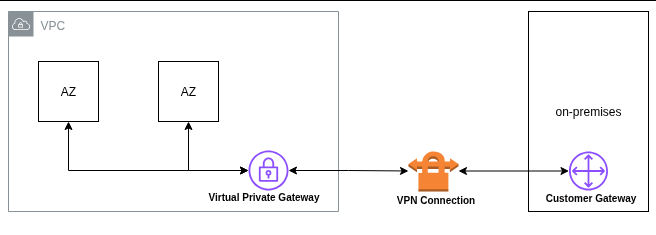

# VPN

## AWS VPN is comprised of two services

#### Site-to-Site VPN
is based on [IPsec](#) and establishes a `VPN tunnel` over the public internet to securely pass data between your on-premises (customer) network and your AWS VPC.

#### Establishment
1. Configure the Customer Gateway (CGW):
* * A device on your on-premises network (router, firewall, or software appliance) that supports IPsec.
* * Provides the public IP and routing info for AWS to connect.
2. Configure the Virtual Private Gateway (VGW) or Transit Gateway (TGW):
* * Acts as the VPN endpoint on the AWS side.
* * VGW is attached to a single VPC; TGW can connect multiple VPCs and on-prem networks.
3. Create the Site-to-Site VPN connection:
* * Establishes a secure IPsec connection between CGW and AWS gateway.
* * Includes routing info and encryption parameters.
4. AWS automatically provisions 2 IPsec tunnels for high availability and redundancy.
* * Tunnels are both AWS-side endpoints, but your on-prem device connects to both.
* * Traffic over the tunnels is encrypted end-to-end using IPsec.

 

 

#### limitations
* IPv6 traffic is not supported for VPN connections on a virtual private gateway.
* AWS VPN connection does not support Path MTU Discovery.
* When connecting multiple VPCs to the same on-premises network, ensure that VPC and on-prem CIDRs do not overlap to prevent routing conflicts.

#### monitoring
monitor VPN tunnels using Amazon [CloudWatch](#), 
* which collects and processes `raw data` from the VPN service into `readable`, near `real-time metrics`. 
* These statistics are recorded for a period of 15 months. 
* You can access historical information and gain a `better perspective` on how your web application or service is performing. 
* VPN metric data is `automatically` sent to [CloudWatch](#) as it becomes available.

#### Pricing
AWS Site-to-Site VPN connection per hour (varies by Region) 
* Data transfer out charges [see Amazon EC2 On-Demand pricing](https://aws.amazon.com/ec2/pricing/on-demand/)
# Consider: 
* AWS Site-to-Site VPN connection per hour (varies by Region)
* Data transfer out charges (see Amazon EC2 On-Demand pricing)
* Hourly charges for two AWS Global Accelerators per VPN connection
* Data Transfer Out Premium (DT-Premium) fees

  

### Client VPN

* Based on [OpenVPN]() technology
* Managed `client-based VPN` service that lets you securely access your AWS resources and resources in your on-premises network
* `Client VPN endpoint` is an AWS-managed entry point for remote clients (like laptops, mobile devices) to connect securely to your AWS network.

### Establishment Process

1. Admin creates the Client VPN endpoint
* * Admin sets up the endpoint and access rules.
* * Specifies authentication (certificate, Active Directory, or SAML) and authorization rules.
* * Assigns a CIDR range for VPN clients.
2. Admin extracts or provides the VPN configuration file That includes:
* * VPN endpoint URL or IP
* * Client certificate (if certificate-based authentication)
* * Keys and other connection parameters
3. User connects using a VPN client app
* * Examples: OpenVPN client, AWS VPN Client.
* * Imports the configuration file.
* * Connects securely to the VPC subnets or authorized resources.
* * Users cannot change endpoint settings
4. Traffic is encrypted via SSL/TLS
* * All data between the client and the Client VPN endpoint is secure.
* * Connection is secure and encrypted.

### Limitation
* No Native Posture Assessment
* CloudWatch Metrics Interval Fixed
* Metrics are published every 5 minutes; interval cannot be changed.
* CIDR Overlap Restrictions
* Max 5,000 concurrent Connections per Client VPN endpoint but you can request increases via AWS support.
* Authentication Limitations
* Throughput Depends on Server & Network
* Performance is limited by VPN endpoint resources and network bandwidth.
* Limited Multi-AZ Redundancy

### Client VPN monitoring
* End-user usage reporting is possible through [CloudWatch]() Logs.
* You can use a `client connect handler` which a [Lambda]() to do basic posture assessment because Client VPN `does not support native posture assessment`.
* Client VPN publishes metrics to [CloudWatch]() for your Client VPN endpoints. Metrics are published to [CloudWatch]() `every five minutes`.

### Pricing
Client VPN pricing is `based on two factors`: 
* Number of `active client` connections per hour 
* * This fee is also prorated for any connections that last `less than an hour`. 
* * Users can connect dynamically as needed, and `charges will reflect their usage time`.
* Number of `subnets associated` with the `VPN endpoint` per hour.
* * VPC owner is billed for each subnet association. 
* * Billing begins as soon as the subnet is associated, and partial hours are prorated.