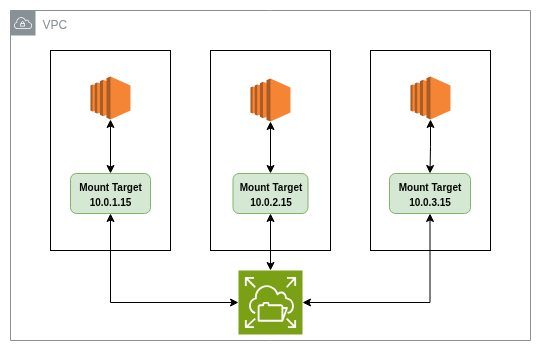

# Elastic File System (EFS)
* Provides `Shared access` file system storage for Linux-based workloads `(Cross AZ)`.
* Supports [Network File System `(NFS)`](../Networking.md#network-file-system-nfs) protocols.
* Compatible with all `Linux-based` AMIs for EC2.
* `Very large capacity`.
* `EC2` connects to `EFS` throw `mount target` which is entry point with (Private IP, `Security Group`) on specific AZ

## Features
* **Scalable**
    * `Automatically` `grows/shrinks` as files are `added/removed` (no capacity planning).
* **Shared access**
    * `Multiple instances` (across `multiple AZs`) can mount the same file system.
* **Availability & Durability**
    * Stored `redundantly` across `multiple AZs` (unless One Zone).
* **Performance Modes**
    * `General Purpose` (default, low latency, good for most workloads).
    * `Max I/O` (higher throughput, more latency — for large, parallel workloads).
* **Throughput Modes**
    * `Bursting` (default, based on size).
    * `Provisioned` (set consistent throughput independent of size).
* **Encryption**
    * `Data at rest (AWS KMS)` & in transit (TLS).
* **Lifecycle Management**
    * Move files `not accessed` recently to `EFS-IA (cost optimization)`.

## Types
* **Standard (Multi-AZ)**
    * Default, highly `available` `across AZs`.
* **One Zone**
    * `Lower-cost`, stores data in a `single AZ` (less HA).
* **Storage Classes**
    * `EFS Standard`
    * `EFS Infrequent Access` (IA)

## Use Cases
* `Lift-and-shift Linux` apps needing shared file storage.
* `Content management systems` (e.g., media sharing).
* `Home directories` for users.
* `Big data analytics` & ML where multiple nodes need shared access.

## Limitations
* `Linux-only` (NFS protocol; no native support for Windows — use FSx for Windows instead).
* `Regional service` (must mount within the same region, but across AZs).
* `Higher latency` compared to local storage (`EBS`).
* `Max file size`: `52 TiB` per file.
* `Not` ideal for `high IOPS` single-thread workloads (use EBS for that).
* Costs: `Higher than S3`, `but scalable`